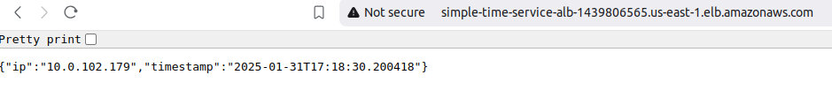

# SimpleTimeService - DevOps Challenge

## Overview

SimpleTimeService is a minimalist microservice that returns the current timestamp and the client's IP address in JSON format. The service is containerized using Docker and deployed on AWS infrastructure using Terraform.

1. **Software Development**: A simple microservice written in Python.
2. **Containerization**: Dockerizing the application and publishing it to Docker Hub.
3. **Infrastructure-as-Code**: Using Terraform to deploy the application on AWS with ECS, VPC, and an Application Load Balancer (ALB).
4. **CI/CD**: A GitHub Actions pipeline to automate building, pushing, and deploying the application.

---

## Project Structure
.
├── .github/workflows # GitHub Actions CI/CD pipeline
├── app        # Application source code and Dockerfile
└── terraform  # Terraform configuration files


## Prerequisites
Before you begin, ensure you have the following installed:
- [Docker](https://docs.docker.com/get-docker/)
- [Terraform](https://developer.hashicorp.com/terraform/downloads)
- [AWS CLI](https://aws.amazon.com/cli/)
- An AWS account with the necessary permissions to create ECS, VPC, ALB, and related resources.
- AWS credentials configured locally using the AWS CLI:
  ```bash
  aws configure

- Docker Hub Account
  A Docker Hub account to publish the container image.

  Docker Hub credentials configured locally:

```sh
docker login
```

## Task 1: SimpleTimeService Application

### Build the Docker Image
```sh
docker build -t simple-time-service ./app
```

### Run the Container
```sh
docker run -p 8080:8080 simple-time-service
```
### Access the service at
[ http://localhost:8080 ]

### Expected JSON response:

```sh
{
  "timestamp": "2023-10-15T12:34:56.789Z",
  "ip": "192.168.1.1"
}
```

### Publish the Docker Image
1. Tag the image with your Docker Hub username:

```sh
docker tag simple-time-service <dockerhub-username>/simple-time-service:latest
```

2. Push the image to Docker Hub:

```sh
docker push <dockerhub-username>/simple-time-service:latest
```
------------------------------------------------------------------------------------

## Task 2: Terraform Infrastructure

### Infrastructure Overview
The Terraform configuration deploys the following AWS resources:

 - VPC: A Virtual Private Cloud with 2 public and 2 private subnets.

 - ECS Cluster: An Elastic Container Service cluster to run the container.

 - ALB: An Application Load Balancer to expose the service.

 - Security Groups: Rules to allow traffic between the ALB and ECS tasks.

### Authentication to AWS

```sh
aws configure  # add aws creds
```

### Deploy the Infrastructure

1. Navigate to the Terraform directory:
```sh
cd terraform
```
2. Initialize Terraform:
```sh
terraform init
```
3. Review the execution plan:
```sh
terraform plan
```
4. Apply the configuration to deploy the infrastructure:
```sh
terraform apply -auto-approve
```

### Access the Service
After deployment, Terraform will output the ALB DNS name. Access the service at:

```sh
http://<alb-dns-name>
```
### Expected response:

```sh
{
  "timestamp": "2023-10-15T12:34:56.789Z",
  "ip": "192.168.1.1"
}
```
*** Practically Tested Outputs Screenshot ***



## Extra Credits

### CI/CD Pipeline (GitHub Actions)
- The repository includes a GitHub Actions workflow (ci-cd.yml) to automate:
 1. Building and pushing the Docker image to Docker Hub.
 2. Deploying the infrastructure using Terraform.

- Prerequisites
 1. Add the following secrets to your GitHub repository's secrets:
 2. OCKERHUB_USERNAME: Your Docker Hub username.
 3. DOCKERHUB_TOKEN: Your Docker Hub access token.
 4. WS_ACCESS_KEY_ID: Your AWS access key.
 5. AWS_SECRET_ACCESS_KEY: Your AWS secret key.

Trigger the Pipeline
Push changes to the main branch to trigger the pipeline.

## Repository URL: 
  


